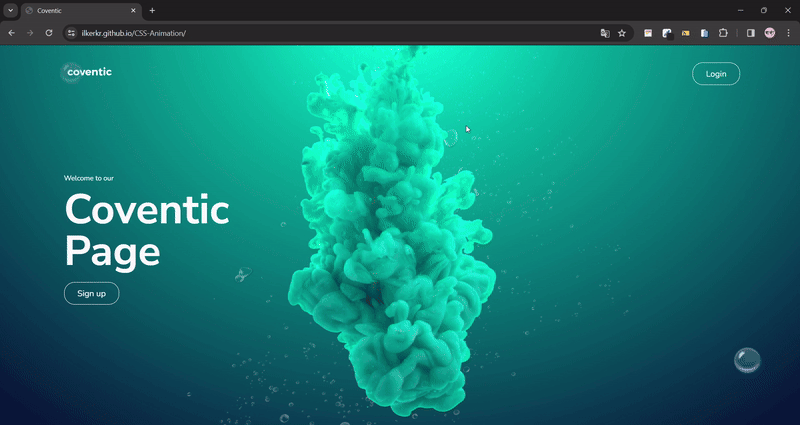

<h1>Coventic Page</h1>



[👉click here to login Coventic Page](https://ilkerkr.github.io/CSS-Animation/)

<h2>Descriptions</h2>
<p>
The coventic page project was created to use the CSS animation feature and be compatible with the project.
</p>

<h2>Project Skeleton</h2>


```
CSS Animation (folder)
|
|----img (folder)                  
|----css (folder)
       |----login.css
       |----signup.css
       |----style.css
|----index.html  
|----login.html
|----signup.html
|----readme.md
```